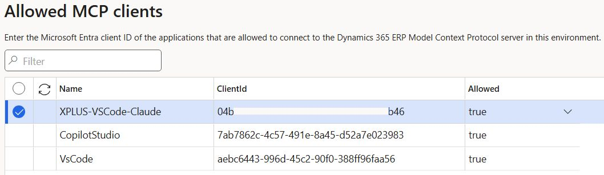

# Claude Code ↔ Dynamics 365 F&O — MCP Integration

A small proxy that lets [Claude Code](https://docs.anthropic.com/en/docs/claude-code) talk to **Microsoft Dynamics 365 Finance & Operations** through the [Model Context Protocol (MCP)](https://modelcontextprotocol.io/).

Once set up, you can query D365 data, navigate forms, and call custom X++ actions — all from Claude Code using natural language.

Tested on WSL Ubuntu, VSCode with Azure CLI Extension installed.

## Why is this needed?

Claude Code talks to MCP servers over **stdio** — it spawns a process and sends JSON-RPC through stdin/stdout. That's it, no HTTP, no WebSocket (as of now).

The D365 F&O MCP server, on the other hand, is a **remote HTTP endpoint** behind **Azure AD authentication**. So there's a gap — and this proxy fills it.

## How it works

The idea is simple: a tiny Node.js script sits in the middle and translates between the two worlds.

```
┌─────────────┐  stdio (JSON-RPC)  ┌──────────────────┐  HTTPS + Bearer  ┌──────────────────┐
│ Claude Code │ ◄───────────────►  │ mcp-dynamics365fo│ ◄──────────────► │ D365 F&O MCP     │
│ (IDE/CLI)   │  stdin / stdout    │ proxy.mjs        │  HTTP POST       │ Server (remote)  │
└─────────────┘                    └──────────────────┘                  └──────────────────┘
                                          │
                                          │ az account get-access-token
                                          ▼
                                   ┌──────────────────┐
                                   │ Azure CLI (az)   │
                                   │ Token Provider   │
                                   └──────────────────┘
```

1. Claude Code spawns the proxy as a child process (configured in `.mcp.json`).
2. It sends JSON-RPC messages to the proxy's stdin.
3. The proxy grabs a Bearer token from Azure CLI and forwards each message as an HTTP POST to the D365 MCP endpoint.
4. D365 responds (plain JSON or SSE stream) — the proxy parses it and writes the result back to stdout.
5. An `mcp-session-id` header is tracked across requests to maintain D365 server-side state.

## Design decisions

**Why a proxy at all?** Because Claude Code only speaks stdio. The D365 MCP server only speaks HTTP. Someone has to translate, and a ~100-line script is the simplest way to do it.

**Why Azure CLI for auth?** The D365 MCP server needs Azure AD tokens. Using `az account get-access-token` is the path of least resistance — no client secrets to manage, no app registrations to create, just your existing `az login` session. It works with MFA, conditional access, all of that.

**Why refresh tokens every 45 min?** Azure AD tokens expire after roughly 60–75 minutes. The proxy refreshes proactively every 45 min so you don't get random failures in the middle of a conversation.

**Why handle SSE?** D365 sometimes responds with `text/event-stream` instead of plain JSON. The proxy handles both transparently — you don't need to worry about it.

## About the ClientID

This is the **Azure CLI client ID** — a first-party Microsoft app registered in Azure AD. It's the same for everyone worldwide. You don't need to create your own app registration.

When you run `az login`, you authenticate through this app. The proxy's `az account get-access-token` call produces a token issued under this client ID.

**How to find yours:**
1. Run: `az account get-access-token --resource https://YOUR-ENVIRONMENT.operations.dynamics.com --query accessToken -o tsv`
2. Paste the token into [jwt.ms](https://jwt.ms)
3. Check the `appid` claim — that's your ClientID (this is different from the default VSCode [ClientID](https://learn.microsoft.com/en-us/dynamics365/fin-ops-core/dev-itpro/copilot/copilot-mcp#allowed-mcp-clients))

More info: [Microsoft docs — Sign in with Azure CLI](https://learn.microsoft.com/en-us/cli/azure/authenticate-azure-cli)

## Prerequisites

- **Node.js 22+** (needs native `fetch`; Node 18+ might work with `--experimental-fetch`)
- **Azure CLI** installed and logged in (`az login`)
- **D365 F&O** environment with MCP server enabled
- **Claude Code** (VSCode extension or CLI)

## Setup

### Step 1: Azure CLI

```bash
# Install if needed: https://learn.microsoft.com/en-us/cli/azure/install-azure-cli

# Log in
az login

# Quick test — should print a long token string
az account get-access-token \
  --resource "https://YOUR-ENVIRONMENT.operations.dynamics.com" \
  --query accessToken -o tsv
```

### Step 2: Register the ClientID in D365

This part is important — D365 won't accept MCP connections unless the client app is explicitly allowed.

1. Open your D365 F&O environment in the browser.
2. Go to **System administration** and search for **"Allowed MCP clients"**.
3. Add a new row:
   - **Name**: `AzureCLI-ClaudeCode` (or whatever you like)
   - **ClientId**: `[Your ClientID]`
   - **Allowed**: `true`
4. Save.



### Step 3: Configure the proxy

Clone or copy the files:

```bash
git clone https://github.com/axpolik/claude-code-d365fo-mcp.git
```

Open `mcp-dynamics365fo-proxy.mjs` and replace the placeholder URLs:

```javascript
const MCP_URL  = 'https://YOUR-ENVIRONMENT.sandbox.operations.dynamics.com/mcp';
const RESOURCE = 'https://YOUR-ENVIRONMENT.sandbox.operations.dynamics.com';
```

You can find your environment URL in the browser address bar when you open D365 (e.g. `https://mycompany.sandbox.operations.eu.dynamics.com`).

### Step 4: Configure Claude Code

Copy the example config to your project root (or `~/.claude/.mcp.json` for global config):

```bash
cp .mcp.json.example /path/to/your/project/.mcp.json
```

Then edit `.mcp.json`:

```json
{
  "mcpServers": {
    "dynamics365": {
      "command": "node",
      "args": ["/absolute/path/to/mcp-dynamics365fo-proxy.mjs"],
      "env": {
        "PATH": "/usr/local/bin:/usr/bin:/bin"
      }
    }
  }
}
```

A few things to keep in mind:
- `command` — can be just `"node"` if it's in your PATH, or the full path like `"/home/user/.nvm/versions/node/v22.22.0/bin/node"`.
- `args` — needs the **absolute path** to the proxy script.
- `env.PATH` — must include the directory where `az` lives. On WSL you might need to add the Windows-side path too (see Troubleshooting).

### Step 5: Test it

1. Open Claude Code in VSCode or terminal.
2. Check the MCP server status — `dynamics365` should show up.
3. Try something like: *"Find the SalesOrderHeaders entity in D365"*.

## Files

```
claude-code-d365fo-mcp/
├── README.md                       # You're reading it
├── mcp-dynamics365fo-proxy.mjs     # The proxy (stdio ↔ HTTP)
├── .mcp.json.example               # Claude Code MCP config template
└── d365foMCPclient_form.jpg        # Screenshot of the D365 config form
```

## Troubleshooting

**"Token refresh failed"** — Your `az login` session expired. Just run `az login` again.

**Proxy starts but no tools show up** — Check three things: (1) MCP server is enabled on your D365 environment, (2) your ClientID is in the "Allowed MCP clients" form, (3) your Azure AD user has the right D365 security roles.

**"fetch is not defined"** — You need Node.js 22+. On older versions, add the flag:

```json
"args": ["--experimental-fetch", "/path/to/mcp-dynamics365fo-proxy.mjs"]
```

**PATH issues on WSL** — If `az` is installed on the Windows side, add it to the PATH in `.mcp.json`:

```json
"env": {
  "PATH": "/usr/local/bin:/usr/bin:/bin:/mnt/c/Program Files/Microsoft SDKs/Azure/CLI2/wbin"
}
```

## D365 MCP Tools

Once connected, you get three categories of tools: **data** (OData CRUD), **form** (UI navigation), and **API** (custom X++ calls). For CRUD operations, prefer data tools — currently they are faster and more reliable.

## License

MIT
